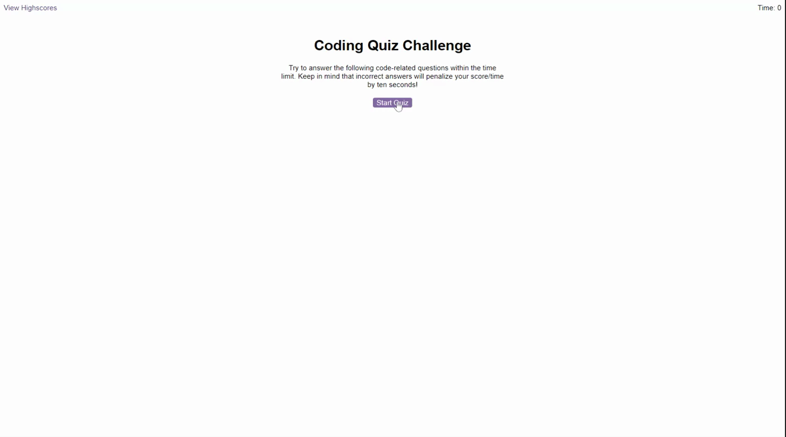

# Javascript Quiz Game

A timed coding quiz that tests your knowledge of JavaScript fundamentals and allows you to store your high scores.

## Description

This coding quiz is designed for coding bootcamp students to gauge their progress in JavaScript. It features a start button that, when clicked, starts a timer and displays the first question. The quiz contains multiple-choice questions with buttons for each answer. When an answer is clicked, the next question appears. If the answer clicked was incorrect, time is subtracted from the clock. The quiz ends when all questions are answered or the timer reaches 0. At the end of the quiz, your score is displayed, and you have the option to save your initials and score for future reference.

## Challenges
One of the main challenges of this project was implementing the timer and score tracking functionality, as it required careful manipulation of variables and logic to ensure accurate and consistent results.

## Things I learned

- Techniques for creating dynamic and responsive user interfaces using JavaScript and the Document Object Model (DOM)
- Strategies for managing and manipulating variables and data structures in JavaScript
- Best practices for structuring and organizing code to improve readability and maintainability
- How to store and retrieve data using Local Storage
- How to create a timer using setInterval() function
- How to implement a score tracking system

## Acceptance Criteria
- A start button that when clicked, a timer starts and the first question appears.
- Questions contain buttons for each answer.
- When an answer is clicked, the next question appears
- If the answer clicked was incorrect then subtract time from the clock
- The quiz should end when all questions are answered or the timer reaches 0.
- When the game ends, it should display their score and give the user the ability to save their initials and their score

## Built With
- JavaScript
- HTML
- CSS

## Application details

Here is the live URL: [https://alinatca.github.io/quiz-game/](https://alinatca.github.io/quiz-game/)

Here is a gif of the application: 

## Contact

You can reach me at:

Github: [GitHub](https://github.com/alinatca)
Email: alina_tca@yahoo.com
Linkedin: [LinkedIn Profile](https://www.linkedin.com/in/alina-tudor-7a1047168/)
